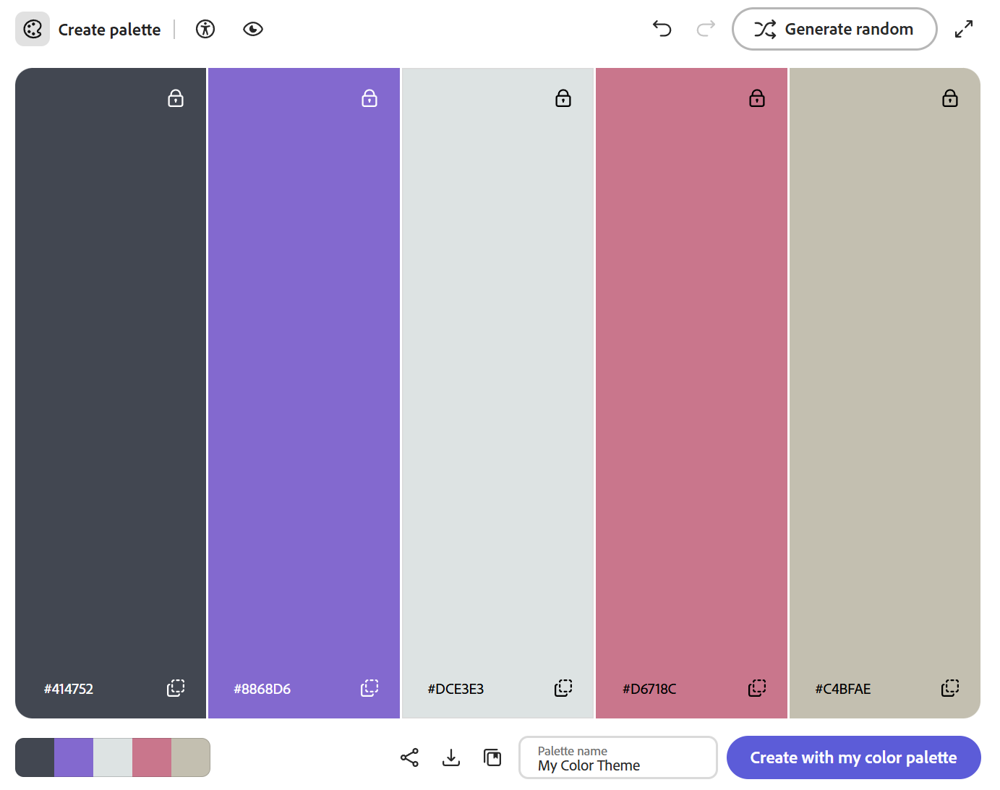

Casey Pietrusewicz
http://a1-charlieroberts.onrender.com

This project shows ...

## Technical Achievements

- **Styled page with CSS**: Added a style.css file to add CSS rules to all of my elements.
  1. Styled the body with background by using a linear gradient. Also used height to ensure the page took up the full screen.
  2. Styled both h1 and h2 using the color rule. Also used text-align to keep the text aligned to the left of the screen.
  3. Added additional more specific rules to the subheadings. Added margin-top to both with different values to create vertical space between sections.
  4. Styled two different divs to create content boxes. Added a background-color, box-shadow, and border. Also used height and width with percentages to create sizes.
  5. Used position: relative for the divs that are moved in the animation. Used position: absolute for the image to ensure it keeps its position.
- **Added a small animation to my page**: Created a file called animation.js to handle an animation for the content divs. I gave both the elements ids to be able to identify them in the JS. The elements start off the screen, then on load of the page, are moved over a set amount of px at a determined interval.
- **Added other other HTML tags to my page**:
  1. : Used to add an image related to the text in my hobby section. Used the src tag to add the image from the web.
  2. <footer>: Added a footer to the bottom of the page and gave it some CSS style. Added the assignment number and a link at the bottom.
  3. <a>: Added a link to my personal GitHub inside of the footer. Set the target equal to "_blank" so that the link opens up another tab in the browser.
  4. <table>: Used a table instead of a list to organize my previous courses. Used the <th> tag to label the header of the table. Each row was defined using <tr>. Each piece of data in the table was labeled <td>.
  5. <figure>: Used to group the image into a larger and related piece of content. Played around with using <figcaption> to add text to the image, but ultimately decided against it.

## Design Achievements

- **Used color palette from adobe website**: I used each color for a different element on the website.
  -Two shades of the gray were used to create a gradient for the background color.
  -The purple is used for the first box, with a darker tone used for the shadow.
  -The pink is used for the second box, with a darker tone used for the shadow.
  -The tan is used for the border colors on boxes and images.
  -The light gray color is used for the title and headers on the page.

- **Used the Unica One Font from Google Fonts**: I used Unica One as the font of all the text on my site.
